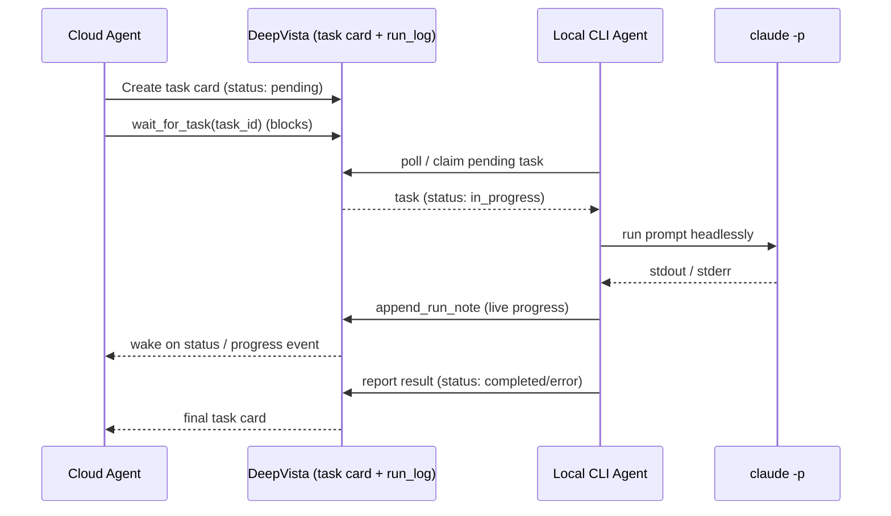

# Real-Time Task Telemetry

When the cloud agent hands work to a CLI agent running on your own machine, you no
longer have to stare at a spinner wondering what is happening. This guide explains
how **Task Delegation** works, how **real-time telemetry** streams the local agent's
status and terminal output back to the cloud, and how developers can monitor a local
CLI agent while it runs.

<Note>
New to delegation? Read
[Automating Linear Tickets via DeepVista Task Delegation](/tutorials/task-delegation-linear)
first — it walks through dispatching a single headless task end-to-end.
</Note>

---

## 1. How Task Delegation works

DeepVista uses a **pull-based task queue**. The cloud agent never connects directly
to your machine; instead it writes a task and your local agent polls for it.



1. **Dispatch.** The cloud agent creates a `type: "task"` context card with
   `status: "pending"` and a prompt in its description.
2. **Wait.** The cloud agent calls the `wait_for_task` tool, which blocks until the
   card leaves `pending` / `in_progress`.
3. **Claim & run.** A locally-registered agent (`deepvista tasks run`) polls the
   queue, claims the task, and executes the prompt with `claude -p` in headless mode.
4. **Report.** When the run finishes, the local agent posts the result and a final
   `run_log`, flipping the task `status` to `completed` or `error`.

Because the task runs on your machine, your credentials and local resources never
leave your environment.

---

## 2. How real-time telemetry works

The challenge with step 2 above is that a long task can run for minutes. Without
telemetry, the cloud agent (and the UI) only see a spinner until the task is done.
Real-time telemetry closes that gap with three cooperating pieces.

### The run log: a single source of truth

Every execution is recorded as a canonical **`run_log` card**. Writers append narrative
lines under a `## Log` heading; the Runs hub and the cloud agent read it back. Two
primitives drive it:

| Primitive | Role |
| --- | --- |
| `append_run_note(note, task_id \| run_id, kind)` | Append a progress line to the active run log |
| `wait_for_task(task_id, timeout_seconds)` | Block (≤120s per call) until the task reaches a terminal status |

### The event bus: Redis pub/sub

Each time a note is appended or a status changes, DeepVista publishes an event to a
per-card Redis channel (`context_card:progress:{card_id}`). The `wait_for_task` tool
subscribes to this channel so it **wakes within milliseconds** of a change instead of
sleeping on a fixed poll interval, with a short fallback re-poll if the event bus is
unavailable.

### The delivery path: Server-Sent Events (SSE)

The browser opens an SSE **context-card watch** connection for the task card. The
backend forwards each Redis event to the client as an SSE message
(`context_card_update` / `run_log_update`), and the chat UI renders the accumulating
run-log tail as a live, auto-scrolling terminal panel beneath the
**"Wait for Local Agent"** indicator.

```text
local agent ──append_run_note──▶ run_log card ──publish──▶ Redis channel
                                                              │
                                              ┌───────────────┴───────────────┐
                                              ▼                               ▼
                                   wait_for_task wakes              SSE ▶ browser terminal panel
                                   (cloud agent relays)             (live status + stdout)
```

<Note>
`wait_for_task` is request/response — it returns the task card's current state, not a
continuous stream. The cloud agent calls it repeatedly (up to ~10 times for ~10 minutes
total), relaying the latest run-log progress to you between calls, while the SSE channel
feeds the live terminal panel in parallel.
</Note>

---

## 3. Monitoring a local CLI agent

You can watch the same telemetry from your own terminal, which is invaluable when
debugging a delegated run.

### Stream progress as the agent works

Inside a delegated task, write intermediate progress at each meaningful step. The
cloud agent and the Runs hub see these lines live:

```bash
deepvista tasks note <task-id> "Step 1 done: located 3 failing tests"
deepvista tasks note <task-id> "Step 2: opening PR…"
deepvista tasks note <task-id> "Needs human: please approve the PR at github.com/…"
```

Each note is appended to the run log and published to the card's progress channel, so
it appears in the UI almost immediately.

### Run the poller in the foreground

When you start the poller interactively, it prints a heartbeat for in-flight tasks so
you can confirm the local agent is alive:

```bash
deepvista tasks run
#   task 1a2b3c4d… still running (30s elapsed) — Create a test Linear ticket
#   ✓ task 1a2b3c4d… completed (exit 0, 42s)
```

### Inspect the run log directly

List recent runs and read a run's log tail to see exactly what the agent reported:

```bash
deepvista tasks list
deepvista card get <run-or-task-id>
```

<Tip>
Designing a long-running task? Have the agent post a `tasks note` at the start and end
of each phase. Frequent, short notes make the live terminal panel far more useful than a
single dump at the end — and they give the cloud agent something concrete to relay while
it waits.
</Tip>

---

## 4. Summary

- **Task Delegation** is pull-based: the cloud agent writes a task, your local agent
  claims and runs it, keeping credentials on your machine.
- **Telemetry** flows through a canonical `run_log`, a Redis event bus, and an SSE
  connection so status and terminal output reach the cloud agent and UI in real-time.
- **Developers** stream progress with `deepvista tasks note`, watch the foreground
  poller heartbeat, and inspect run logs with `deepvista tasks list` / `card get`.
